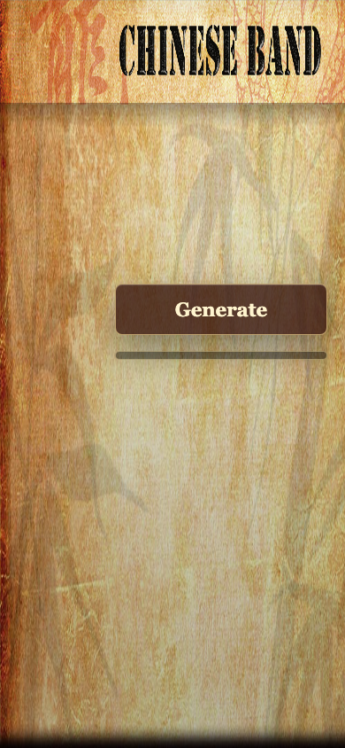

# ChineseBand Jam



A one-button AI music toy that asks a model to arrange tiny guzheng and percussion samples, then bravely pretends this was the plan all along.

Built with Vite, React, and a Cloudflare Worker because apparently even a button now needs an edge runtime.

## Run It

```sh
npm install
npm run worker:dev
```

## Deploy It

```sh
npm run deploy
```
