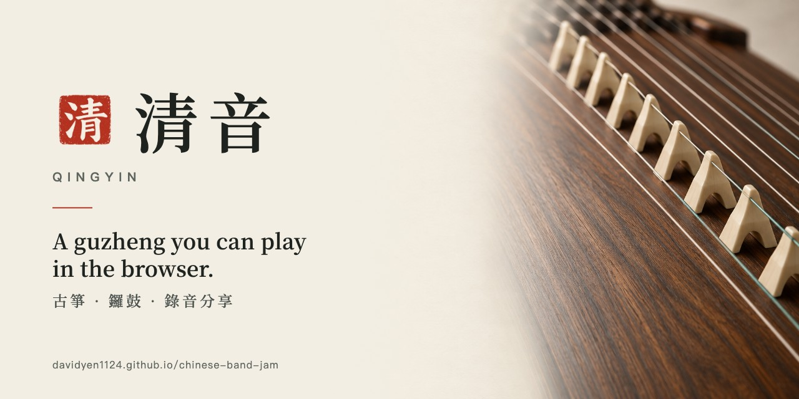
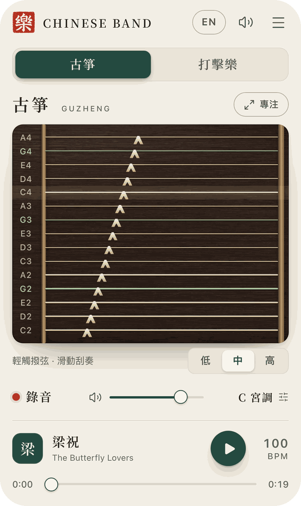
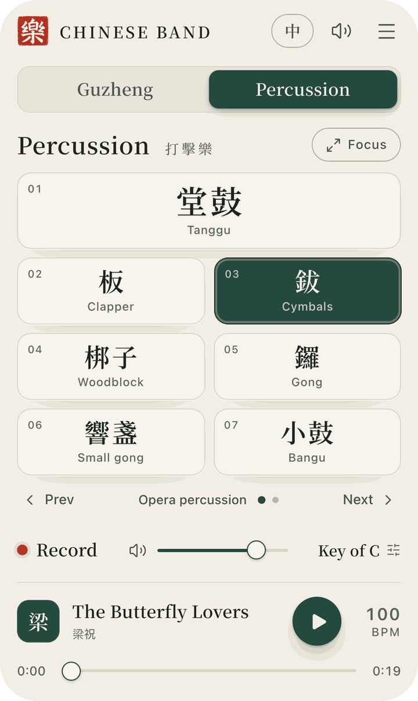
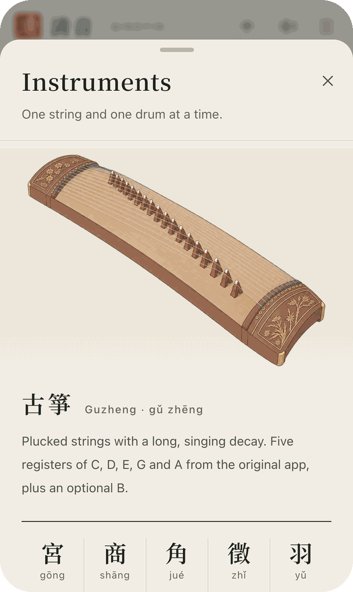
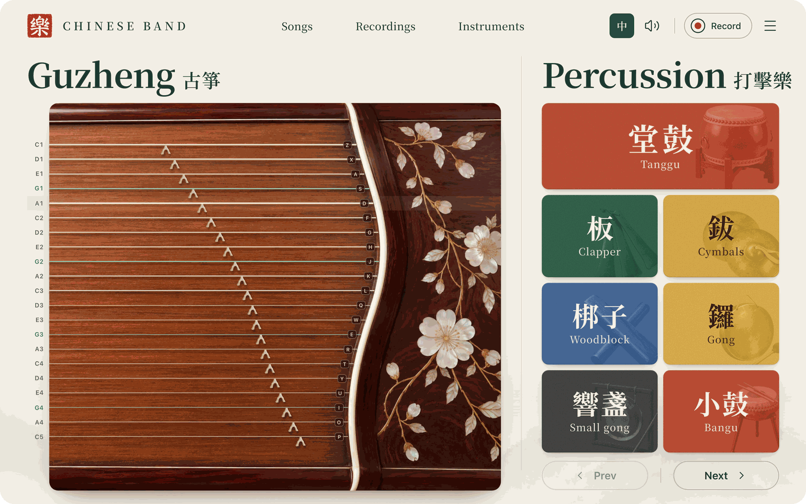

<p align="center">
  
</p>

# Chinese Band

**A guzheng and a pile of Chinese opera percussion that live in your browser tab.**
No app store, no account, no subscription, no AI, no "join the waitlist." You touch a string, a string makes a sound. We are as shocked as you are.

**▶ Play it:** [davidyen1124.github.io/chinese-band](https://davidyen1124.github.io/chinese-band/)

<p align="center">
  
  
  
</p>

<p align="center">
  
</p>

## What it does

- **Guzheng (古箏).** Fifteen strings across three registers over a photographed lacquered soundboard, with bone bridges (雁柱) marching diagonally toward the carved front bridge and a mother-of-pearl head panel, because a guzheng without bridges is just a very sad shelf. The green strings are the "5", like the real thing. Tap to pluck, swipe to glissando like you trained for twelve years. Multi-touch, so all ten fingers can be wrong at the same time.
- **Percussion (打擊樂).** 堂鼓, 板, 鈸, 梆子, 鑼, 響盞, 小鼓, plus a second bank of war drums and flowerpot drums with separate heads and rims, all painted in mineral pigments (cinnabar, pine, azurite, gamboge, ink). Enough to start a Peking opera, or a noise complaint.
- **No toolbar.** Record, songs and the menu are three small buttons up top. Start a song and it becomes a capsule in the header; stop it and it's gone. Hit record and the header turns red with a timer and a Done button, and nothing else on screen moves. We tried a permanent bottom bar first. It was always there, like a coworker who wants to "circle back."
- **The whole band on a big screen.** On a laptop the guzheng and the drums share one stage, so you can glide the strings with the mouse and hit gongs on the number keys at the same time. On a phone they're two pages; swipe the title to switch.
- **Songs.** Three originals from the 2012 app (鴛鴦蝴蝶夢, 菊花台, 梁祝) with every note and voice preserved, plus four new studies. Play along, loop, slow them down to 50% and pretend that was the plan.
- **Record, rename, share.** Recordings stay on your device. Export a real WAV your friends can open without installing anything, or a JSON score you can import later. It even reads legacy Chinese Band `.txt` files, in case you have a 2012 Android phone in a drawer and unresolved feelings.
- **中文 / English.** Every screen, every dialog, every error message. The language button is in the top-right, where it has always been, in every app, since the dawn of time.
- **Works on phones.** Portrait, landscape (the strings stand upright), Add to Home Screen, and it plays with the iPhone silent switch on, because apparently that needed its own paragraph of code.
- **Keyboard.** `P O I U Y T R E W Q L K J H G` for strings, `1`–`8` for drums, `Esc` to leave focus mode. For the three desktop users who read READMEs.

## Things that used to be here

| Feature | Status | Reason |
| --- | --- | --- |
| A single "Generate" button that asked a language model to compose music | Deleted | It was a button that cost money to press. |
| A Cloudflare Worker proxying said language model | Deleted | A static page does not need an edge runtime. It barely needs a runtime. |
| **Air play**: waving your hand over the laptop to strum the guzheng via 19 kHz Doppler sonar through the mic and speakers | Deleted | It worked, technically, on one MacBook, while the dog left the room. |
| A second name, 清音 Qingyin, plus a third one, `chinese-band-jam` | Deleted | One app, one name. It only took three names to get here. |

## Run it

```sh
npm install
npm run dev
```

Open the URL Vite prints. Tap **啟音 · 開始演奏** (or **Tap to begin**), because browsers refuse to make noise until you prove you are a human who wants noise.

## Ship it

Push to `main`. [`.github/workflows/deploy.yml`](.github/workflows/deploy.yml) lints, builds, and publishes `dist/` to GitHub Pages. That's the whole ops story. There is no server to page you at 3 a.m. There is no server.

The build uses relative paths, so `dist/` also works from a subfolder, a custom domain, or a USB stick you hand to your aunt.

## How it's built

- **Vite + React + TypeScript**, one page, no router, no state library, no regrets.
- **Web Audio** for sample playback, scheduled on the audio clock so a fast glissando doesn't wait for React to finish having thoughts.
- **IndexedDB** for recordings, `localStorage` for your volume and language, and absolutely nothing else leaves your device.
- **The layout** was picked from three concepts generated with Codex's frontend-app-builder, after an unreasonable amount of staring at guzheng, guqin, koto and opera-drum apps on the App Store and Google Play. The losers were a control rail and a scrolling jianpu strip. They took it well. The soundboard and bridges were then photographed by an image model, because the hand-drawn one looked like a toy.
- **Native `<dialog>`** for every sheet and modal: the browser handles focus, Escape and the backdrop, which is more than most component libraries manage.
- Type is **Noto Serif TC**. The palette is rice paper, pine ink, walnut and one cinnabar seal, loosely following the Palace Museum's digital collection rather than a takeout menu.

## Credits

- **Sounds and the three original songs:** *Chinese Band* 1.3 (2012), Designed in Taiwan by Hsin‑Chien CHENG, Jun‑An YEN and Yo‑Wei TENG. The 45 samples are the originals; checksums live in [`src/lib/asset-provenance.json`](src/lib/asset-provenance.json).
- **Seal, icon, instrument plates, ink-wash mountains and guzheng photo:** generated with an image model, then cropped by a human with opinions.
- **Design references:** 故宮博物院數字文物庫, 國立故宮博物院, 數字敦煌, 每日故宮, and several guzheng apps that taught us what not to do with gold filigree.

## FAQ

**Is it accurate?** The green strings are the "5" (sol), just like a real guzheng. The bridges sit on a diagonal, just like a real guzheng. It does not need tuning for forty minutes before every lesson, unlike a real guzheng.

**Why is it called Chinese Band?** It's what the 2012 app was called, the samples still answer to it, and after a brief identity crisis as 清音, Qingyin and `chinese-band-jam`, we ran out of naming budget. Naming things is one of the two hard problems in computer science. We solved it by giving up.

**Can I play it in a real concert?** You can. We can't stop you. Please send video.
